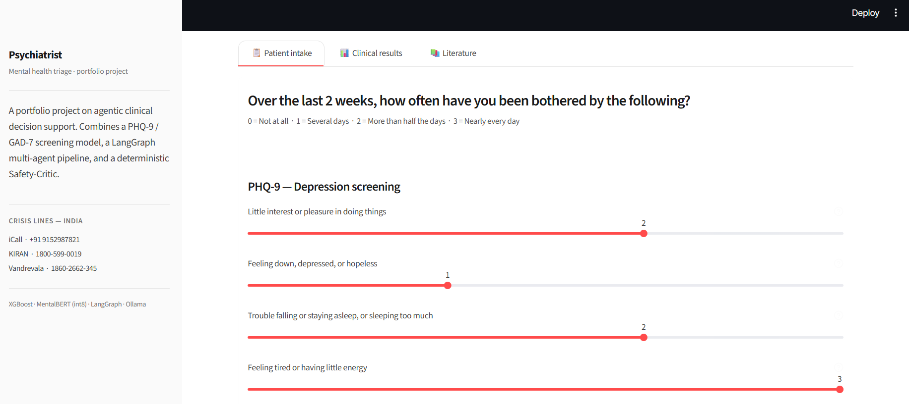
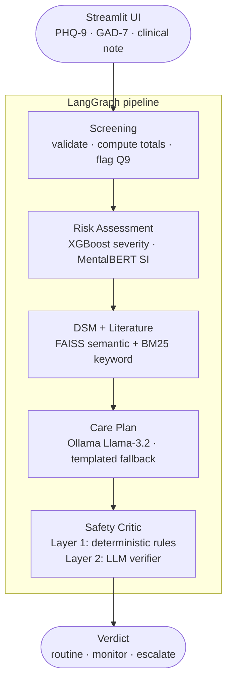
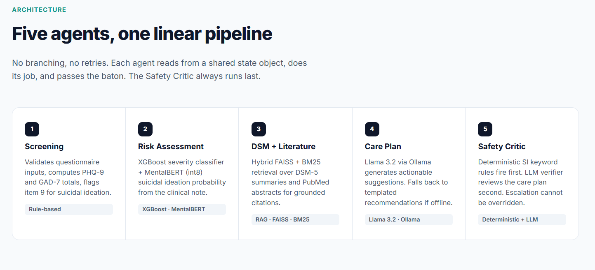

<div align="center">

# Psychiatrist

A portfolio project on agentic clinical decision support. Fill in a PHQ-9 / GAD-7 screening, write a short clinical note, and get back a severity label, a safety verdict, and a care plan — all generated by a five-agent LangGraph pipeline running entirely on CPU.



[](https://github.com/omprxkash/data-scientist-langgraph/actions/workflows/ci.yml)


**[Architecture](ARCHITECTURE.md) · [Safety Contract](SAFETY.md)**

</div>

---

## Why I built this

I got tired of reading about agentic AI and wanted to actually build something with it — something where the agents have a real reason to exist, not just a chain of LLM calls dressed up as a pipeline.

Mental health triage clicked for a few reasons. The clinical structure is well-defined — PHQ-9 and GAD-7 are standard questionnaires used in real clinics, DSM-5 criteria are public knowledge. The domain is text-heavy, so everything runs on CPU. And there's one constraint that can't be negotiated away: if someone mentions suicidal ideation, the system has to escalate. Full stop. No bargaining with a language model.

That last constraint turned out to be the most interesting part to build. What if Ollama is offline? What if the XGBoost model hasn't been trained yet? Can a hallucinating care-plan agent talk the safety layer into a quieter verdict? I spent more time on those failure modes than anything else — and the answers (deterministic rules that fire before any LLM sees the text, fallbacks at every step, a regression suite that blocks merges) ended up shaping the whole architecture.

The other goal was a single project that touches everything end-to-end: classical ML, clinical NLP, RAG, agent orchestration, MLOps. Not five disconnected notebooks — one thing that actually holds together.

---

## Try it locally

No GPU. No Ollama. No pre-trained models required — everything degrades gracefully to rules and templates.

```bash
pip install -e ".[dev]"
python data/generate.py --n 50000 --out data/processed
streamlit run serving/app.py
```

For the complete setup with Ollama and trained models, see [Running the full pipeline](#running-the-full-pipeline).

---

## How it works

Five agents run in a fixed sequence on every request. Each one reads from a shared state object, does its job, and passes the baton — no branching, no retries, no surprises.



### The five agents

**Screening** validates the questionnaire scores, computes PHQ-9 and GAD-7 totals, and immediately flags item 9 (suicidal ideation) if it's non-zero. That flag travels through the entire pipeline and reaches the Safety Critic regardless of what any other agent says.

**Risk Assessment** runs two models back to back: an XGBoost classifier trained on questionnaire scores to predict severity band (none / mild / moderate / severe), and MentalBERT — a BERT model pre-trained specifically on mental health text, int8-quantized to run on CPU — to score suicidal ideation probability from the clinical note. Both fall back gracefully if their checkpoints aren't present.

**DSM + Literature** searches two local indexes — paraphrased DSM-5 criteria summaries and PubMed psychiatry abstracts — using FAISS for semantic similarity and BM25 for keyword precision, then merges and re-ranks the hits. This gives the care plan something to cite rather than hallucinating suggestions from scratch.

**Care Plan** takes the severity band, detected symptoms, and retrieved passages, then asks Llama 3.2 via Ollama to turn them into actionable suggestions. If Ollama isn't running, it falls back to templated recommendations keyed to severity band — so the UI always gives you something useful.

**Safety Critic** always runs last, and it runs two layers in strict order:

- *Layer 1 — deterministic:* scans the narrative sentence by sentence for suicidal ideation keywords, with carve-outs for reported speech ("patient denied any ideation"). If this layer fires, the verdict is `escalate`, Layer 2 is skipped, and nothing downstream can change it.
- *Layer 2 — LLM verifier:* reviews the generated care plan for hallucinated symptoms, overconfident claims, and things the system shouldn't assert. It can upgrade `routine` → `monitor`, but it cannot downgrade an escalation. For moderate-or-above severity, the minimum verdict is `monitor`.



There's a 16-case regression suite covering overt ("I want to end my life") and subtle ("I've been thinking there's no point anymore") suicidal ideation patterns. It runs on every push and must pass at 100% recall. That suite is what I actually trust — not the LLM.

---

## Screenshots

All screenshots are in the [`images/`](images/) folder. Here's what the app looks like end-to-end.

---

## Stack

| Layer | What I used | Why |
|---|---|---|
| Agent orchestration | LangGraph | Explicit graph — each node is a Python class, independently testable |
| LLM | Llama-3.2-3B via Ollama | Fully local, no API keys, no per-call cost |
| SI detection | MentalBERT int8 | Pre-trained on mental health text; genuinely better for this domain than general BERT |
| Severity model | XGBoost + PyTorch MLP | XGBoost outperforms deep models on tabular questionnaire data |
| Retrieval | FAISS + BM25 hybrid | Semantic alone misses exact clinical terms; keyword alone misses meaning |
| UI | Streamlit | Fast to iterate; custom CSS makes it look less generic |
| API | FastAPI | Pydantic validates item ranges; per-IP rate limiting |
| MLOps | MLflow + Evidently | Experiment tracking + drift monitoring |
| Training data | Synthetic PHQ-9 / GAD-7 | No real patient data anywhere in this repo |

---

## What's in here

| Path | What it is |
|---|---|
| [ARCHITECTURE.md](ARCHITECTURE.md) | Deep-dive — per-agent design, Safety Critic internals, retriever implementation |
| [SAFETY.md](SAFETY.md) | Safety contract — what can and can't change without a full review |
| [agents/](agents/) | LangGraph DAG and all five agent classes |
| [models/](models/) | XGBoost + MLP training, MentalBERT fine-tuning and int8 quantization |
| [rag/](rag/) | FAISS + BM25 retriever, DSM and PubMed ingestion |
| [serving/](serving/) | Streamlit UI (`app.py`) and FastAPI service (`api.py`) |
| [spark_jobs/](spark_jobs/) | PySpark ETL for production-scale synthetic data |
| [monitoring/](monitoring/) | Evidently drift reports and per-request safety audit log |
| [tests/safety/](tests/safety/) | 16-case SI regression suite — 100% recall is the release gate |

---

## Tests

```bash
make safety          # the suite that matters — must be 16/16
make test            # full pytest run with coverage
make lint            # ruff + mypy
```

The safety suite runs in CI without Ollama or any trained checkpoints — agents fall back to rules automatically, which is the whole point.

---

<details>
<summary><b>Running the full pipeline</b></summary>

```bash
ollama pull llama3.2

# Train the models
make train

# Build the RAG indexes
make rag-index

# Start everything
make serve        # Streamlit on :8501
make api          # FastAPI on :8000
```

MentalBERT fine-tuning takes a few hours on CPU. Pass `--max-train-samples 5000` to `make train` if you just want to verify it runs.

</details>

<details>
<summary><b>Honest caveats</b></summary>

**Trained on synthetic data.** The PHQ-9 and GAD-7 score distributions are calibrated against published prevalence tables, but there's no real patient data here. Outputs reflect what a model trained on plausible synthetic records produces — which isn't the same as clinical validation.

**The fallbacks matter.** Without Ollama, without MentalBERT, without the trained XGBoost checkpoint — the system still runs. The Safety Critic's deterministic rules still fire. It's worse, but it's not broken.

**No patient data anywhere.** The audit log stores feature vectors and model predictions only.

</details>

<details>
<summary><b>What's still left to build</b></summary>

| Thing | Status |
|---|---|
| Model checkpoints | Not in repo — run `make train` to produce locally |
| RAG indexes | Not in repo — run `make rag-index` |
| Docker | Directory scaffolded, Compose file in progress |
| Deployment | Deciding between Hugging Face Spaces and Render |

</details>

---

## License

MIT — see [LICENSE](LICENSE).
